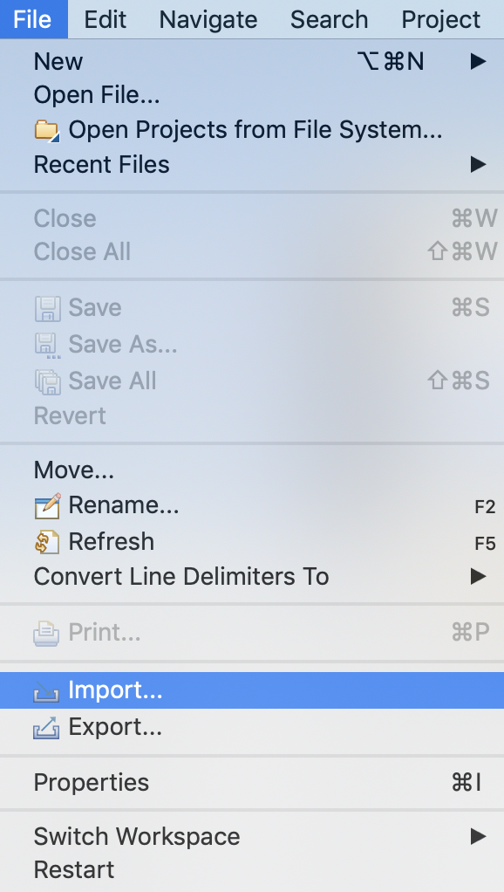
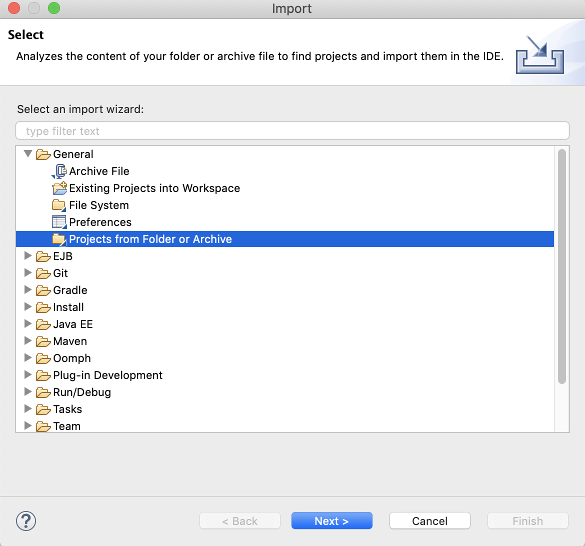
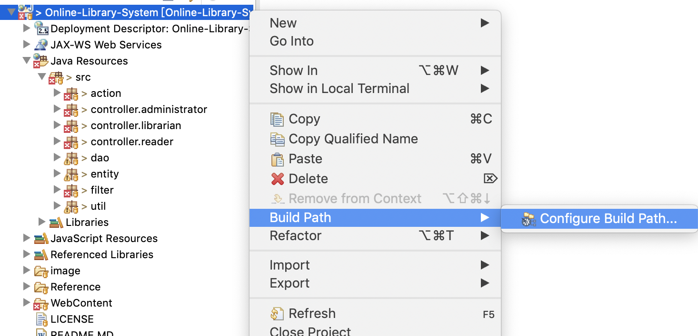
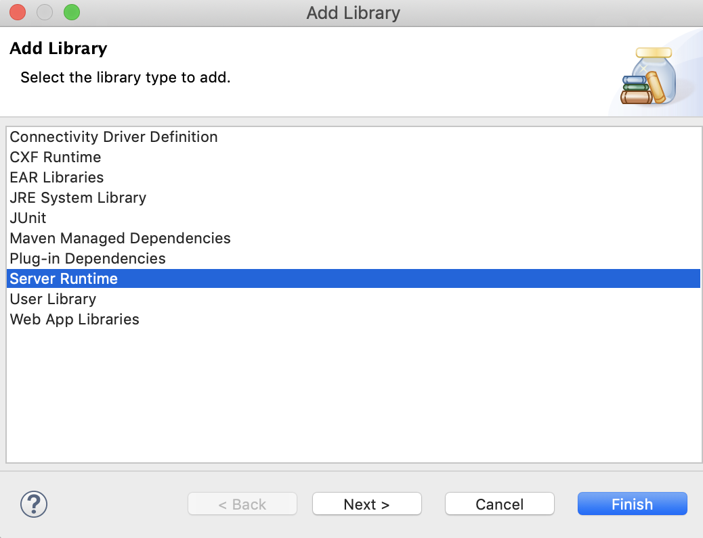
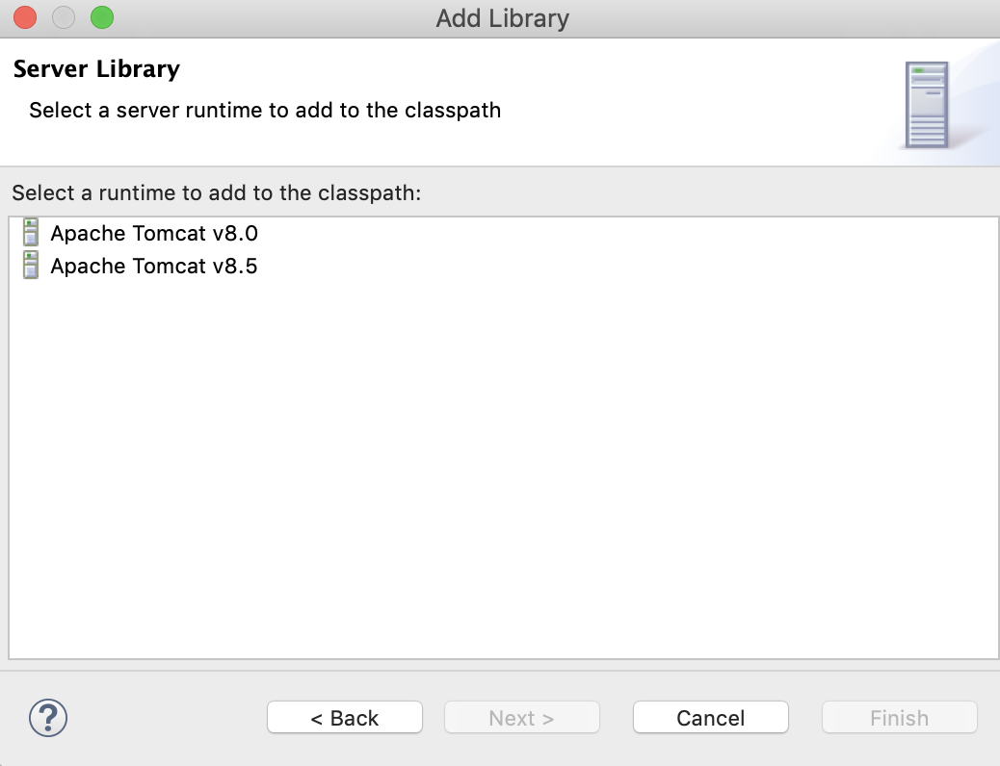
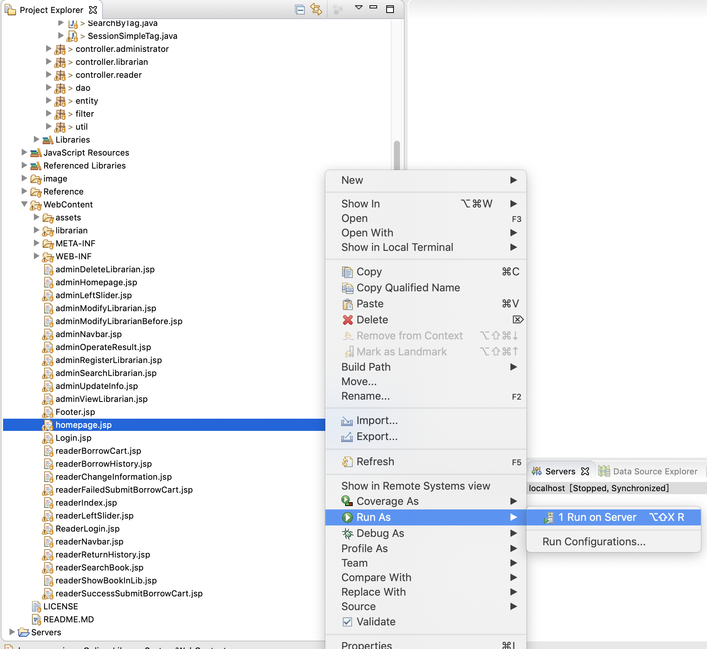
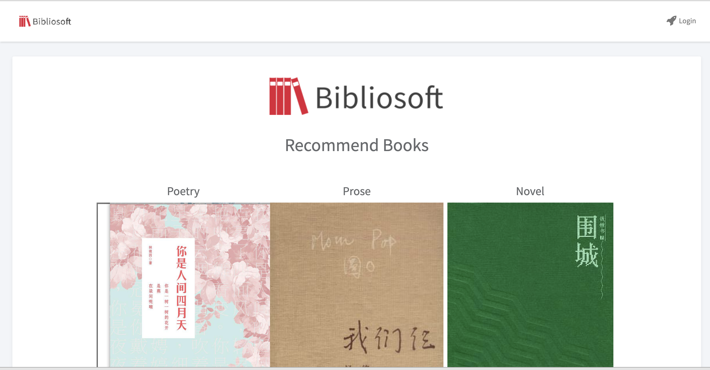
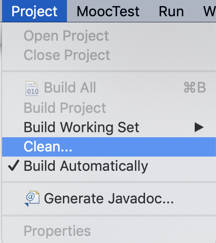

# 开发环境
* 操作系统：Windows 10 64位，macOS 10.13及以上，Linux 64位
* IDE：[Eclipse](https://www.eclipse.org/downloads/download.php?file=/oomph/epp/2018-12/R/eclipse-inst-win64.exe)   
* 数据库: [MySQL8.0](https://dev.mysql.com/downloads/installer/)   
* 服务器：[tomcat8.5或以上](https://tomcat.apache.org/download-80.cgi)   

# 运行项目   
1. 将项目拷贝到本地，打开Eclipse，选择“Files”下的“Import”

   

2. 选择导入文件的类型   

   

3. 选择文件路径   

   

4. 因为是在Tomcat容器中进行操作的，需要配置Tomcat环境，如下所示   

   

   

   

如果没有Tomcat容器请先配置Tomcat容器

5. 建立数据库   
在[数据库设计](./Reference/DatabaseDesign/)中，选择`createTableSQL.sql`和`data.sql`，在MySQL下运行，就完成数据库的创建   

6. 运行首页   
在选择Tomcat容器，生成数据库之后，选择homepage.jsp,右击运行   

   

   
如果有问题的话，先对该项目进行clean后再重新运行   

   

更多操作参考 [软件用户手册](./Reference/document/OLMS-SUM-1.0软件用户手册.pdf)   

# 开发文档   
* [可行性分析报告](./Reference/document/OLMS-FAR-1.0可行性分析报告.pdf)   
* [软件开发计划](./Reference/document/OLMS-SDP-1.0软件开发计划.pdf)   
* [软件测试计划](./Reference/document/OLMS-STP-1.0软件测试计划.pdf)   
* [软件设计说明](./Reference/document/OLMS-SDS-1.0软件设计说明.pdf)   
* [软件需求规格说明](./Reference/document/OLMS-SRS-1.0软件需求规格说明.pdf)   
* [数据库设计说明](./Reference/document/OLMS-DBDD-1.0数据库设计说明.pdf)   
    * [详细数据库设计](./Reference/DatabaseDesign/)   
* [软件版本说明](./Reference/document/OLMS-SVD-1.0软件版本说明.pdf)   
* [软件用户手册](./Reference/document/OLMS-SUM-1.0软件用户手册.pdf)   
* [项目开发总结报告](./Reference/document/OLMS-PDSR-1.0项目开发总结报告.pdf)   

# 贡献者   
* [GroverZhu](https://github.com/GroverZhu/)
* [AldrichZeng](https://github.com/AldrichZeng)
* [YuhsiHu](https://github.com/YuhsiHu)
* [2016303276](https://github.com/2016303276)
* [PatchouliJY](https://github.com/PatchouliJY)
* [CharleyYoung](https://github.com/CharleyYoung)

